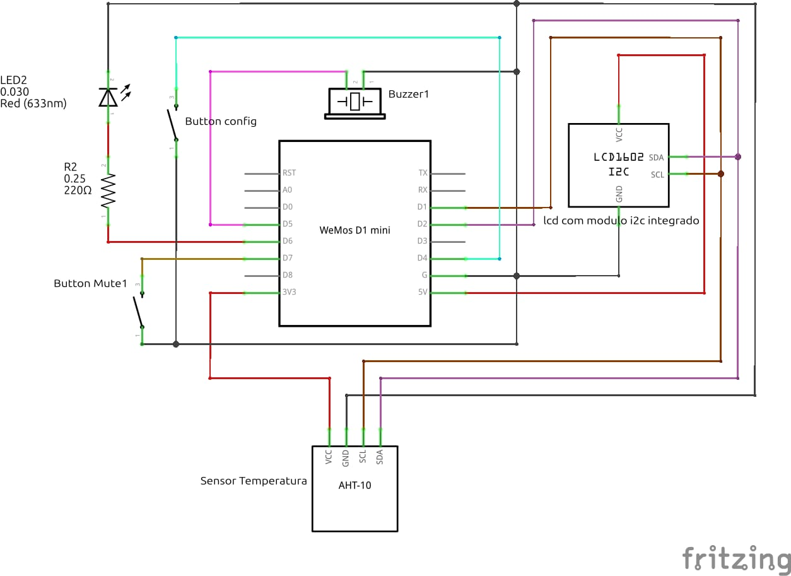

#  Microcontrolador para monitoriamento de temperatura e umidade

> Sistema IoT de monitoriamento de temperatura e umidade utilizando o microcontrolador ESP8266 D1 Mini e Protocolo MQTT para envio de dados.

---

## 🚀 Funcionalidades

- Leitura de temperatura e umidade, feita a cada segundo pelo sensor aht10;
- Monitoriamento em tempo real feita por uma tela LCD;
- Envio de dados do sensor a cada 3 minutos por meio do protocolo MQTT;
- Armazenamento de dados em storage local caso o mensagem não seja enviada ao borker;
- Emite alerta sonoro e visual caso o sistema detecte umidade ou temperatura fora do limite estabelecido por configuração;
- Configuração de parâmetros por meio de acesso do ponto de acesso wifi;
- Reconexão automática ao broker MQTT e rede WiFi;

---

## ✅ Requisitos


### hardware

- ESP8266 D1 Mini;
- LCD 16x2 com módulo i2c;
- Sensor AHT10;
- 2 botões;
- 1 Led Red 5mm;
- 1 resitor de 220 ohm;
- 1 buzzer ativo;


#### Esquema eletrônico



#### Pinos utilizados do ESP8266 D1 Mini

| Componente         | pinos                        | Pinos de alimentação |
|--------------------|------------------------------|----------------------|
| `Sensor AHT10`       | D1 (SCL), D2 (SDA), GND      | 3,3V                 |
| `Buzzer Ativo `      | D5, GND                      |                      |
| `LCD 16x2`           | D1 (SCL), D2 (SDA), GND      | 5V                   |
| `LED red 5mm `       | D6, GND (precisa de resitor) |                      |
| `Botao Mute`         | D7, GND                      |                      |
| `Botao Configuração` | D4, GND                      |                      |


### Software

- Arduino IDE;
- Broker MQTT;
- Core do ESP8266 instalado;
- Bibliotecas necessárias:
    - Adafruit AHTX0;
    - Adafruit BusIO;
    - Adafruit GFX Library;
    - Adafruit SH110X;
    - Adafruit Unified Sensor;
    - Arduino Json;
    - LiquidCrystal_I2C;
    - PubSubClient;

---

## 💻 Instalação

1. Abra o Arduino IDE;
2. Faça a instalação das bibliotecas listadas a cima;
3. clone o repositorio do github:

    ~~~bash
    git clone https://github.com/Embarcatech-Residencia-CAPEDII/Projetos.git
    ~~~
4. copie os arquivos presentes na pasta microcontrolador encontradas na pasta monitoriamento-de-temperatura;
5. cole todos os arquivos dentro da pasta do seu projeto no Arduino IDE;
6. Selecione a placa 
    - Ferramentas → Placa → LOLIN(WEMOS) D1 R2 & mini

---

## ⚙️Configuração

1. Abra o arquivo config.h e altere a variavel `SSID_ACCESS_POINT` para o nome que preferir, e coloque um senha de no mínino 8 caaracteres para `PASSWORD_ACCESS_POINT`.
    ```cpp
    constexpr const char* SSID_ACCESS_POINT = "xxxxxxxxxxxxx"; // Nome da Rede Wifi
    constexpr const char* PASSWORD_ACCESS_POINT = "xxxxxxxxxxxx"; // Senha da Rede Wifi
    ```

    > Essas variáveis são essenciais para a configuração do ESP8266, pois é necessario essas credenciais para obter acesso ao ponto de acesso do microcontrolador.

2. Envie o codigo para o ESP8266;
3. Precione o botao de configuração por 15 segundos;
4. Com um computador ou celular entre na Rede WiFi que você definiu em `SSID_ACCESS_POINT` e coloque a senha que você definiu em `PASSWORD_ACCESS_POINT`;
5. Acesse o navegador e coloque o ip que está aparecendo na LCD;
6. Preencha o formulário com informações do broker MQTT, Rede WiFi e parâmetros de medição de temperatura.